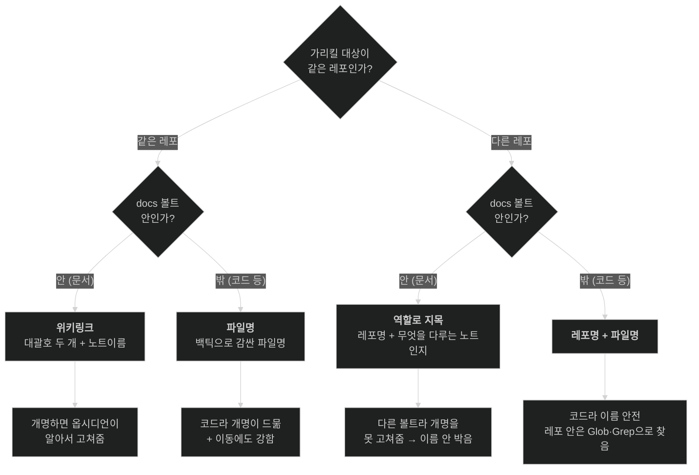
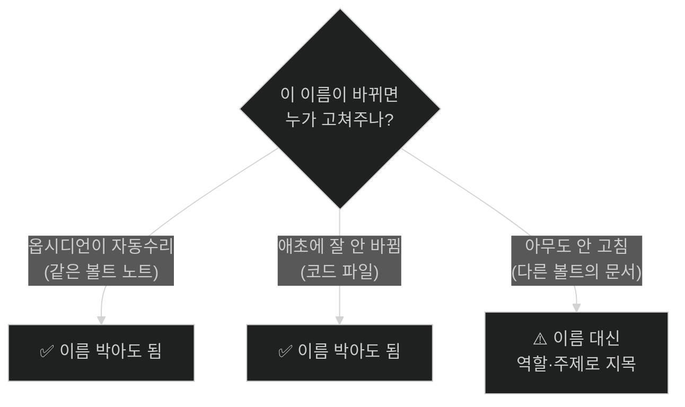
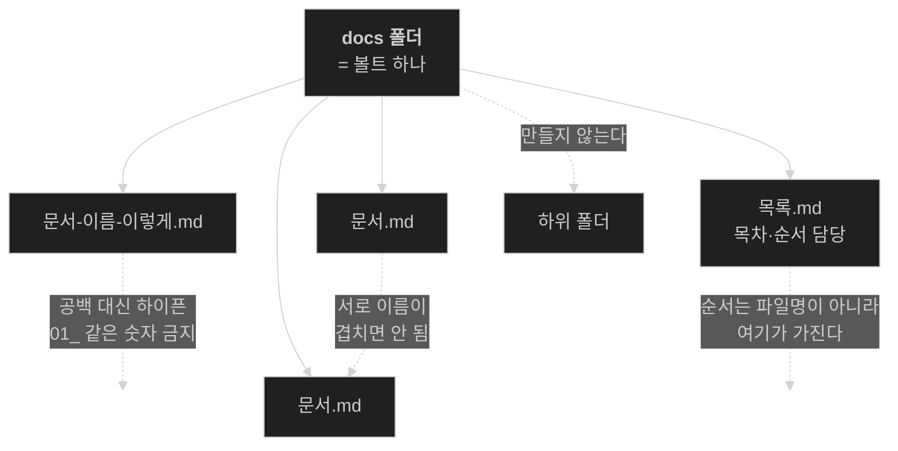
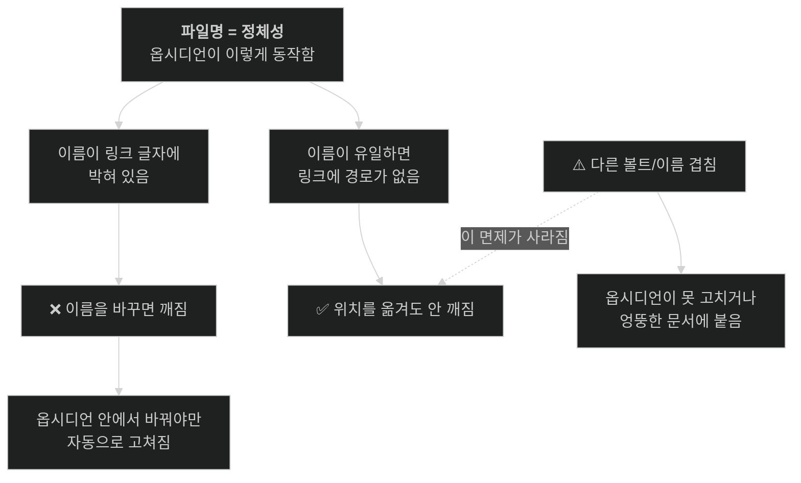
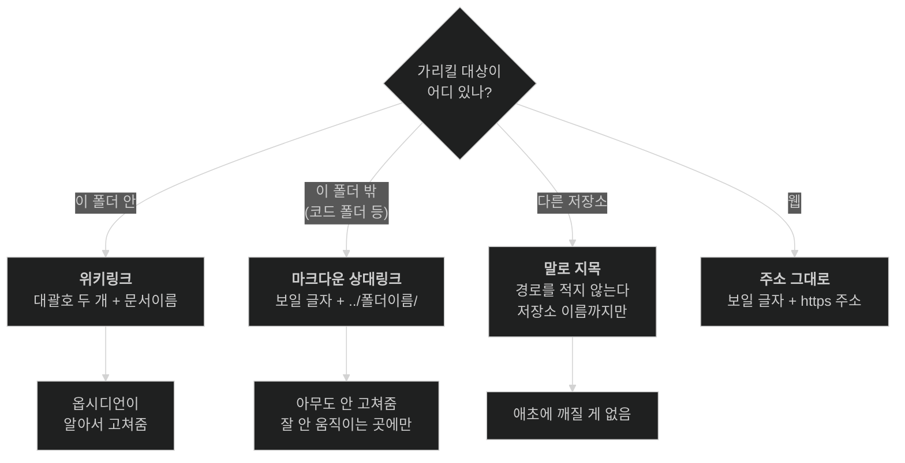

# 문서 링크 · 구조 규칙

> [!info] 이 문서는 **2026년 7월 16일 시점의 스냅샷**입니다.
> 규칙의 **정본은 지식 위키**(`knowledge` 레포의 `문서-인프라` 갈래)이고, 이 문서는 요한이 옵시디언에서 편하게 보라고 배포되는 **파생 사본**입니다. 정본이 개정되면 이 스냅샷을 새로 찍습니다. 옛 스냅샷은 지우지 않고 문서 맨 아래에 이력으로 남깁니다.
> *(2026-08-30 — 자동 메모리가 폐지되어 정본이 메모리에서 지식 위키로 옮겨졌습니다. 아래 규칙 내용 자체는 그대로입니다.)*

---

## 링크 규칙 — 두 축으로 4구역

가리킬 대상을 **① 같은 레포냐 다른 레포냐**, **② docs(볼트) 안이냐 밖이냐** 두 축으로 나누면 네 경우가 됩니다.

| | **docs 안**(옵시디언 볼트) | **docs 밖**(코드 등) |
|---|---|---|
| **같은 레포** | 위키링크 `[[노트]]` | 파일명 `` `deploy.sh` `` |
| **다른 레포** | 레포명 + 역할/주제 ("`X` 레포 docs의 배포 가이드") | 레포명 + 파일명 ("`X` 레포의 `` `deploy.sh` ``") |

> **`[[` 를 치면 이 폴더 안 문서만 자동완성됩니다.** 뜨면 첫 번째 칸(같은 레포 docs 안)입니다.
> **스코프를 안 붙이면 "같은 레포"입니다** — `[[노트]]`가 "이 볼트"를 뜻하는 것과 똑같이, 백틱 파일명도 "이 레포" 기준입니다. 다른 레포일 때만 "`X` 레포의"를 앞에 붙입니다.

**같은 경로·파일명을 여러 문서에 적지 않습니다.** 한 곳에만 적고, 나머지는 그곳을 가리킵니다.

---

## 왜 이렇게 나뉘나 — "이름을 박아도 되나?"

네 칸을 가르는 건 결국 한 질문입니다. **"이 이름이 바뀌면 누가 고쳐주나?"**

- **개명돼도 자동으로 고쳐지거나**(같은 볼트 → 옵시디언이 백링크를 다시 씀) **애초에 이름이 잘 안 바뀌면**(코드 파일 → 사람이 안 다룸) → **이름을 박습니다.** 찾기가 정확해집니다.
- **개명은 잦은데 아무도 안 고쳐주면**(다른 레포 = 다른 볼트의 문서. 옵시디언은 자기 볼트 안에서만 고침) → **이름을 박지 않고 역할·주제로 지목**합니다. 이름은 바뀌어도 그 노트가 다루는 주제는 안 바뀌니까요.

### 볼트 밖은 왜 상대링크가 아니라 파일명인가

`[백엔드](../backend/deploy.sh)` 같은 마크다운 상대링크는 **옵시디언에서 클릭해도 안 열립니다** — 옵시디언이 볼트 밖을 못 열기 때문입니다. 남는 실익은 GitHub에서 렌더될 때 클릭되는 것 하나뿐이라, **README처럼 GitHub에서 읽히는 문서에만** 상대링크를 씁니다. 나머지는 파일명을 백틱으로 박는 게 낫습니다 — 폴더가 옮겨져도 파일명이 그대로면 찾을 수 있어 **이동에도 더 강합니다.**

---

## 문서 구조 규칙

**죽은 문서는 그냥 지웁니다.** 보관용 폴더를 만들지 않습니다.

---

## ⚠️ 이 셋만 지키면 된다

> **1. 문서 이름이 서로 겹치지 않게 한다** (같은 볼트 안)
> **2. 이름 변경은 반드시 옵시디언 안에서 한다**
> **3. 다른 레포의 문서는 이름이 아니라 역할로 가리킨다**

나머지는 전부 여기서 따라 나옵니다. 그리고 이걸 어겼을 때만 **조용히** 틀립니다 — 에러가 안 나고, 링크는 멀쩡히 열리고, 다만 다른 문서가 열립니다.

---
---

# 왜 이런 규칙인가

아래는 이유입니다. 규칙만 지키실 거면 안 읽으셔도 됩니다. 이 규칙들은 취향이 아니라 **옵시디언이 링크를 실제로 푸는 방식**에서 따라 나온 것입니다.

## 1. 문서의 정체성은 경로가 아니라 파일명이다

옵시디언은 볼트(이 `docs` 폴더) 전체를 훑어서 **"파일명 → 실제 파일"** 대응표를 만듭니다. `[[문서이름]]` 을 만나면 이 표에서 이름을 찾지 폴더를 따라 내려가지 않습니다. 그래서 이름이 볼트 안에서 유일하면 링크에 **경로가 아예 안 들어갑니다.**

> If the file name is unique, then it's just the filename.
> If it's not unique, then it's the absolute path from the vault root.

즉 경로는 정상 수단이 아니라 이름이 겹칠 때만 쓰는 비상 수단입니다.

## 2. 그래서 위치를 옮겨도 안 깨진다

링크에 경로가 없으니 파일이 어느 폴더로 가든 고칠 글자가 없습니다. 옵시디언이 켜져 있든, `git mv` 든, 로디안이 옮기든 똑같습니다.

## 3. 반대로, 이름을 바꾸면 깨진다

링크 글자 안에 이름이 박혀 있기 때문입니다. 옵시디언은 이름을 바꾸는 순간 볼트 전체의 링크를 다시 쓰지만, **옵시디언이 그 변경을 목격했을 때만**입니다.

| 이름을 바꾼 주체 | 링크가 고쳐지나 |
|---|---|
| 옵시디언 안에서 | **고쳐짐** |
| 파일 탐색기 · VSCode · `git mv` · 로디안 | **안 고쳐짐** |

## 4. 볼트 밖 · 다른 레포는 왜 다른가

"볼트 밖"이란 옵시디언 대응표에 없는 것입니다. `docs` 폴더 바깥(코드 등)은 옵시디언이 훑지 않아 `[[ ]]` 로 가리킬 대상이 못 됩니다. → **파일명을 박습니다**(코드는 개명이 드물어 안전하고, 이동에 강함).

**다른 레포**는 한 술 더 뜹니다. 그건 **다른 볼트**라, 그 안의 문서를 개명해도 옵시디언이 **내 볼트의 링크는 못 고칩니다.** 그래서 다른 레포의 문서는 이름이 아니라 **역할·주제**로 가리킵니다("`X` 레포 docs의 배포 가이드"). 코드 파일은 개명이 드무니 "`X` 레포의 `` `deploy.sh` ``"처럼 파일명을 박아도 됩니다. 레포 안에서 어디 있는지는 파일명으로 찾습니다(폴더별 `CLAUDE.md` 인덱스를 두던 방식은 2026-07-26 폐기됐습니다 — 수동이라 조용히 낡았습니다).

## 5. 하위 폴더 · 정렬용 숫자를 안 붙이는 이유

폴더는 찾는 데 쓰이지 않으면서 **이름 충돌 위험만 숨깁니다**(다른 폴더에 같은 이름 파일을 넣을 수 있게 되니까). `01_` 같은 숫자를 붙이면 그 숫자가 이름의 일부라, 순서를 바꾸려 숫자를 고치는 순간 그게 개명이 되어 3번의 문제가 됩니다. 순서는 [[목록]] 노트가 갖습니다.

## 6. 이름이 겹치면 조용히 틀린다

이 구조에서 **유일하게 경고 없이 틀리는 지점**입니다. 같은 이름 문서가 둘 생기면 대응표에 답이 둘이 되고, 손으로 친 `[[겹친이름]]` 은 먼저 찾은 쪽에 매칭됩니다. 실제로 `[[classes]]` 가 아무 경고 없이 `java/classes` 로 옮겨 붙은 사례가 있습니다. → **이름 겹침 금지는 이 구조가 서 있는 전제입니다.**

## 정리 — 무엇이 무엇에 기대고 있나

---

## 근거

- 링크 형식과 자동 수리 — [옵시디언 공식 문서](https://obsidian.md/help/links)
- "파일명이 유일하면 파일명만" — [옵시디언 포럼, 개발팀 확인](https://forum.obsidian.md/t/settings-new-link-format-what-is-shortest-path-when-possible/6748)
- 이름 충돌로 링크가 조용히 다른 문서를 가리킨 사례 — [옵시디언 포럼](https://forum.obsidian.md/t/disambiguiting-mutiple-files-with-the-same-name/32110)

충돌 시의 동작은 공식 문서에 적혀 있지 않습니다. 개발팀 발언과 관찰된 동작에서 나온 것이라 향후 조용히 바뀔 수 있습니다.

---
---

# 📁 이전 스냅샷 (2026-07-15) — 이력용, 현재 규칙 아님

> 아래는 4구역으로 재정립하기 전의 규칙입니다. "볼트 밖 → 마크다운 상대링크"처럼 지금과 다른 부분이 있으니 **위쪽 최신 스냅샷을 따르세요.** 이력 보존용으로만 남깁니다.

## 링크 규칙 — 가리킬 대상이 어디 있나 (구)

> 이 구(舊) 규칙의 문제: **"다른 저장소"라는 말이 중의적**이라, 같은 레포의 docs 밖 파일을 가리킬 때도 "다른 저장소"로 착각해 그냥 폴더만 가리키고 끝내는 오적용이 있었습니다(2026-07-16). 그래서 위쪽처럼 **같은/다른 레포 × docs 안/밖** 두 축의 4구역으로 재정립했습니다.
