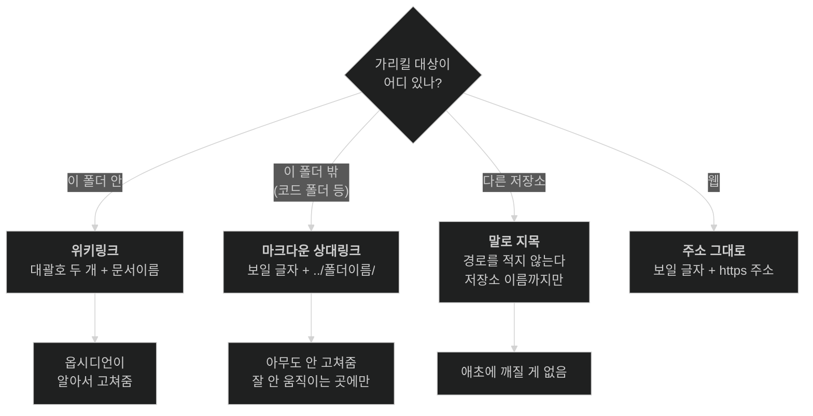
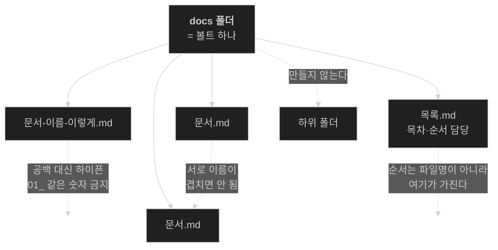
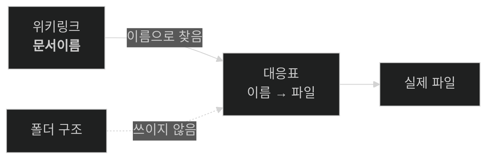
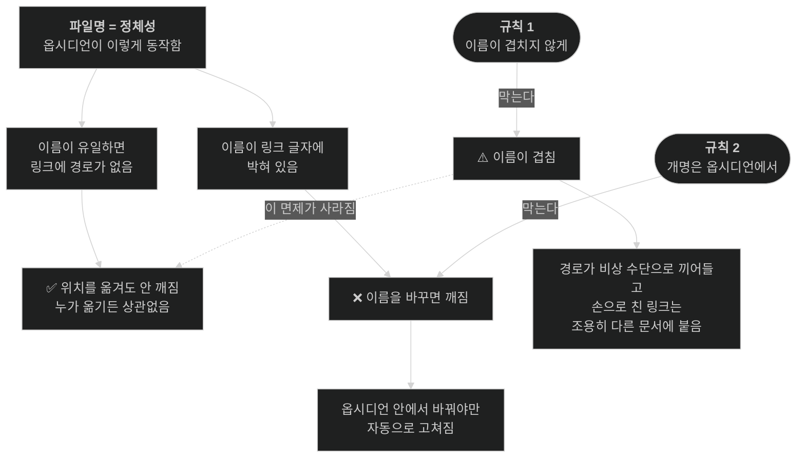

# 문서 링크 · 구조 규칙

> [!info] 이 문서는 **2026년 7월 15일 시점의 스냅샷**입니다.
> 규칙이 나중에 바뀌어도 고치지 않습니다. 지금의 규칙·도구 동작과 다를 수 있습니다.

---

## 링크 규칙 — 가리킬 대상이 어디 있나

> **`[[` 를 치면 이 폴더 안 문서만 자동완성됩니다.** 뜨면 첫 번째 칸, 안 뜨면 나머지 셋 중 하나입니다.
> 즉 위 판단은 대부분 도구가 대신 해줍니다.

**같은 경로를 여러 문서에 적지 않는다.** 한 곳에만 적고, 나머지는 그곳을 가리킨다.

---

## 문서 구조 규칙

**죽은 문서는 그냥 지웁니다.** 보관용 폴더를 만들지 않습니다.

---

## ⚠️ 이 둘만 지키면 된다

> **1. 문서 이름이 서로 겹치지 않게 한다**
> **2. 이름 변경은 반드시 옵시디언 안에서 한다**

나머지 규칙은 전부 이 둘에서 따라 나옵니다. 그리고 **이 둘을 어겼을 때만 조용히 틀립니다** — 에러가 안 나고, 링크는 멀쩡히 열리고, 다만 다른 문서가 열립니다.

---
---

# 왜 이런 규칙인가

아래는 이유입니다. 규칙만 지키실 거면 안 읽으셔도 됩니다.

이 규칙들은 누가 정한 취향이 아니라, **옵시디언이 링크를 실제로 푸는 방식**에서 전부 따라 나온 것입니다.

## 1. 문서의 정체성은 경로가 아니라 파일명이다

옵시디언은 볼트(이 `docs` 폴더) 전체를 훑어서 **"파일명 → 실제 파일"** 대응표를 만들어 둡니다. `[[문서이름]]` 을 만나면 이 표에서 이름을 찾습니다. 폴더를 따라 내려가지 않습니다.

그래서 이름이 볼트 안에서 유일하면, 링크에 **경로가 아예 들어가지 않습니다.** `[[문서이름]]` — 이게 전부고, 폴더 정보가 없습니다.

옵시디언 개발팀의 설명이 이걸 그대로 말합니다.

> If the file name is unique, then it's just the filename.
> If it's not unique, then it's the absolute path from the vault root.

즉 **경로는 정상 수단이 아니라, 이름이 겹칠 때만 쓰는 비상 수단**입니다.

## 2. 그래서 위치를 옮겨도 안 깨진다

링크 안에 경로가 없으므로, 파일이 어느 폴더로 가든 **고쳐야 할 글자가 없습니다.** 대응표만 다시 만들어지고 `[[문서이름]]` 은 그대로 맞습니다.

이건 옵시디언이 켜져 있든 꺼져 있든 상관없습니다. `git mv` 로 옮기든, VSCode에서 옮기든, 로디안이 옮기든 똑같습니다. **고칠 게 없는 일에는 자동 수리가 필요 없기 때문입니다.**

## 3. 반대로, 이름을 바꾸면 깨진다

링크 글자 안에 **이름이 박혀 있기 때문**입니다. `옛이름` 을 `새이름` 으로 바꾸면, 그걸 가리키던 `[[옛이름]]` 은 이제 대응표에 없는 이름이 됩니다.

옵시디언은 이걸 자동으로 고칩니다. 이름을 바꾸는 순간 볼트 전체를 뒤져서 그 이름을 쓰던 링크를 전부 다시 씁니다. **단, 옵시디언이 그 변경을 목격했을 때만입니다.**

| 이름을 바꾼 주체 | 링크가 고쳐지나 |
|---|---|
| 옵시디언 안에서 | **고쳐짐** |
| 파일 탐색기 · VSCode · `git mv` · 로디안 | **안 고쳐짐** |

옵시디언은 실행 중일 때 파일 변화를 감시해서 반응합니다. 꺼져 있는 동안 밖에서 바뀐 이름은, 나중에 켜도 "원래 그런 파일이었다"고 볼 뿐 **누가 뭘로 바꿨는지 알 방법이 없습니다.** 그래서 옛 이름을 가리키던 링크는 깨진 채 남습니다.

## 4. 하위 폴더를 안 만드는 이유

1번 때문입니다. 옵시디언이 이름으로 문서를 찾는데 폴더를 만들면, 폴더는 **찾는 데 쓰이지 않으면서 이름 충돌 위험만 숨깁니다.** 서로 다른 폴더에 같은 이름 파일을 넣을 수 있게 되니까요.

하위 폴더 없이 늘어놓으면 볼트의 파일 목록과 옵시디언의 대응표가 **정확히 같아집니다.** 폴더 탐색을 포기하는 대신, 도구가 보는 세계와 사람이 보는 세계가 일치합니다.

찾기는 `Ctrl+O`(이름), [[목록]](목차), `Ctrl+Shift+F`(내용)로 합니다.

## 5. 정렬용 숫자를 안 붙이는 이유

`01_`, `02_` 를 붙이면 그 숫자가 **파일 이름의 일부**가 됩니다. 즉 3번의 문제가 됩니다 — 순서를 바꾸려고 숫자를 고치는 순간 그건 이름 변경이고, 그걸 가리키던 링크가 전부 영향을 받습니다.

순서 정보를 이름에 박는 대신 [[목록]] 노트가 갖게 하면, 순서를 바꿔도 파일은 가만히 있습니다.

## 6. 이름이 겹치면 조용히 틀린다

이게 이 구조에서 **유일하게 경고 없이 틀리는 지점**입니다.

같은 이름의 문서가 둘 생기면 대응표에 답이 두 개가 됩니다. 이때:

- **옵시디언이 새로 만드는 링크**에는 구분용 폴더 경로가 끼어듭니다. → 그 순간부터 그 링크는 위치 이동에 취약해집니다(2번의 면제가 사라짐)
- **손으로 친 `[[겹친이름]]`** 은 **먼저 찾은 쪽에 매칭**됩니다. 어느 쪽인지 보장이 없습니다.

실제 보고된 사례가 있습니다. `[[classes]]` 가 `python/classes` 를 가리키고 있었는데, 다른 폴더에 같은 이름 파일이 생기자 **아무 경고 없이 `java/classes` 로 옮겨 붙었습니다.**

에러가 안 납니다. 링크는 멀쩡히 열립니다. 다만 다른 문서가 열릴 뿐입니다.

→ **이름 겹침 금지는 취향이 아니라 이 구조가 서 있는 전제입니다.** 2번(이동해도 안 깨짐)도 여기에 매달려 있습니다.

## 7. 볼트 밖은 왜 다른가

"볼트 밖"이란 **옵시디언의 대응표에 없는 것**을 말합니다. 이 `docs` 폴더 바깥은 옵시디언이 훑지 않으므로 표에 없고, 그래서 `[[ ]]` 로 가리킬 대상이 아예 되지 못합니다. `[[` 자동완성에 안 뜨는 게 그 증거입니다.

밖을 가리키는 두 수단은 성질이 다릅니다.

**마크다운 상대링크** — `[백엔드](../backend/)`
파일시스템 경로를 글자 그대로 적는 것입니다. 옵시디언은 이걸 자기 표로 풀지 않으므로 **자동 수리 대상이 아닙니다.** 대상이 움직이면 그냥 깨집니다. 코드 폴더처럼 잘 안 움직이는 곳에만 씁니다.

**말로 지목** — "`저장소이름` 저장소의 `docs` 폴더"
경로를 아예 안 적습니다.

## 8. 왜 경로를 안 적고 말로 지목하는가

경로를 문서에 적으면 그건 **그냥 글자**입니다. 어떤 도구도 추적하지 않고, 대상이 움직여도 아무도 안 고칩니다. 그리고 같은 경로를 여러 문서에 복사해두면, **하나 옮겼을 때 적어둔 모든 곳이 한꺼번에 틀려집니다.** 조용히.

그래서 **가장 안 움직이는 단위까지만** 지목합니다. 저장소 이름은 잘 안 바뀌지만, 그 안의 문서 이름은 자주 바뀝니다. 문서를 콕 집어 적으면 몇 초를 아끼는 대신 **틀릴 수 있는 지점**을 하나 만드는 셈입니다. 이 폴더들은 하위 폴더가 없어서 어차피 열면 전부 보입니다.

## 정리 — 무엇이 무엇에 기대고 있나

**지켜야 하는 두 규칙이 각각 무엇을 막고 있는지**가 이 그림의 요점입니다.

---

## 근거

- 링크 형식과 자동 수리 — [옵시디언 공식 문서](https://obsidian.md/help/links)
- "파일명이 유일하면 파일명만" — [옵시디언 포럼, 개발팀 확인](https://forum.obsidian.md/t/settings-new-link-format-what-is-shortest-path-when-possible/6748)
- 이름 충돌로 링크가 조용히 다른 문서를 가리킨 사례 — [옵시디언 포럼](https://forum.obsidian.md/t/disambiguiting-mutiple-files-with-the-same-name/32110)

충돌 시의 동작은 **공식 문서에 적혀 있지 않습니다.** 위 내용은 개발팀 발언과 관찰된 동작에서 나온 것이라, 향후 조용히 바뀔 수 있습니다.
